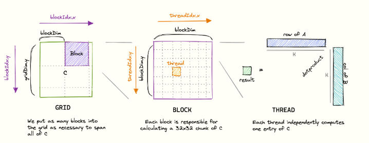

## Performance

The calculation we are doing a dot product between two matrices ( A , B ) to produce the C matrix. Thats Tthree 1024² Floats

Total runtime on RTX 4080:
For a matrix multiplication of two 4092² matrices, followed by an addition of a 4092² matrix (to make the GEMM):

- Total FLOPS :   2 * 1024² + 1024²  = 3, 145, 728 = 3 GFLOPS
- Total Data to read: 3 * 1024² * 4b = 12 MB
- Total Data to store: 1024² * 4B = 4 MB
    

NOTE: RTX *4080* convectional wisdom 97.5 TFLOPS for tensor operations using Tensor Float 32.

